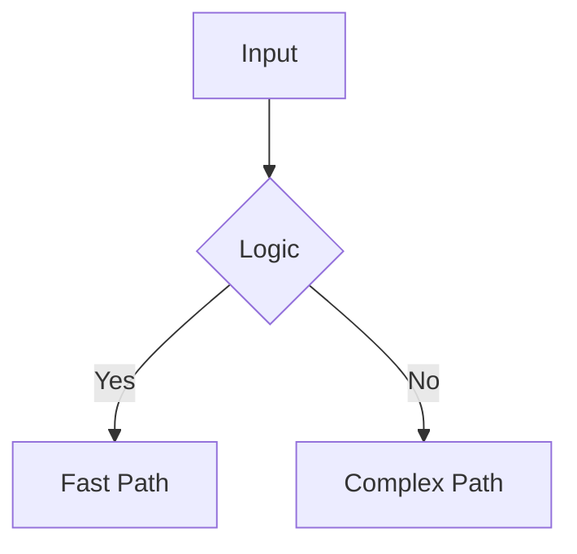

# 📝 SPECIFY: Feature Specification

> **Protocol:** This document MUST be filled and approved before any code is written. 
> **Goal:** Bridge the gap between "Vibe" and "Implementation" through rigorous intent definition.

## 🎯 Objective
**Summary:** [Concise description of the feature or refactor]
**Why:** [Link to issue or strategic goal]

## 🧠 Context & Risk
- **Impact:** [High/Medium/Low]
- **Allocations:** [Zero-Alloc Required / Standard]
- **Compatibility:** [Breaking Change / Additive]

## 📋 Requirements (The "Must Haves")
1. [ ] Requirement A
2. [ ] Requirement B
3. [ ] Requirement C

## 🧪 Verification Plan (The "Truth")
- **Unit Tests:**
    - [ ] `Test_HappyPath_Scenario`
    - [ ] `Test_EdgeCase_Scenario`
- **Benchmarks:**
    - [ ] Compare vs previous baseline
- **Manual Verification:**
    - [ ] [Specific User Flow]

## 🧱 Architecture / Design
> Use Mermaid or clear assertions.

## 🪜 Implementation Steps
1. Create `Isotope` (Test Case)
2. Implement Core Logic
3. Refine & Optimize
4. **LOVE** Check (Code Review)
