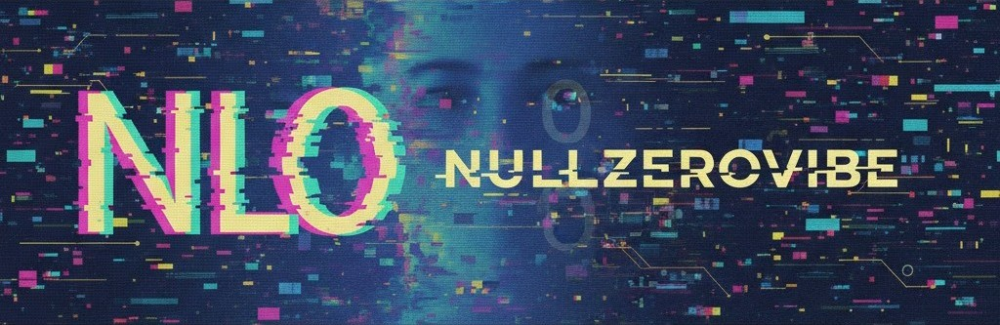

# N u l l Z e r o V i b e
<pre>
▄▀▀▄░█▀▀█░█▀▀▄░█▀▀ 
█░░░░█░░█░█░░█░█▀▀ 
▀▄▄▀░█▄▄█░█▄▄▀░█▄▄ 
</pre>

` ░▒▒▓▓ LIFETIME OF SYNTAX // AGENTIC EVOLUTION ▓▓▒▒░ `

---

### ◈ THE MANIFESTO

> **Legacy meets Autonomy.**
> After a lifetime of building the stack, I've moved beyond the keyboard. 
> I don't just write lines; I orchestrate intent. 
> This is **Vibecoding**: High-level reasoning, agentic execution, and zero friction.

---

### 🛠️ ARCHITECTURAL STACK
* **The Core:** Lifetime of Full-Stack Engineering & System Architecture.
* **The Shift:** 1 Year of Agentic Development & LLM Orchestration.
* **The Output:** 100% Open Source (MIT). I build for the commons.

### 🤖 CURRENT AGENTIC FOCUS
* **Autonomous Workflows:** Self-healing CI/CD and agent-led refactoring.
* **Vibe-Driven UI:** Rapid prototyping where the intent is the documentation.
* **Neural Tooling:** Building the next generation of developer experience.

---

### 📡 CONNECT / COLLABORATE
* **GitHub:** [nullzerovibe](https://github.com/nullzerovibe)
* **Email:** [nullzerovibe@gmail.com](mailto:nullzerovibe@gmail.com)
* **Status:** `[■■■■■■■■■□] Orchestrating the next vibe...`

---

*Everything you find here is yours to fork, break, and build upon.*
**KEEP THE VIBE ALIVE.**

